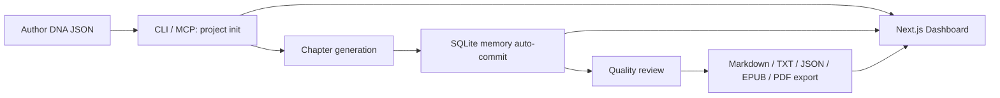
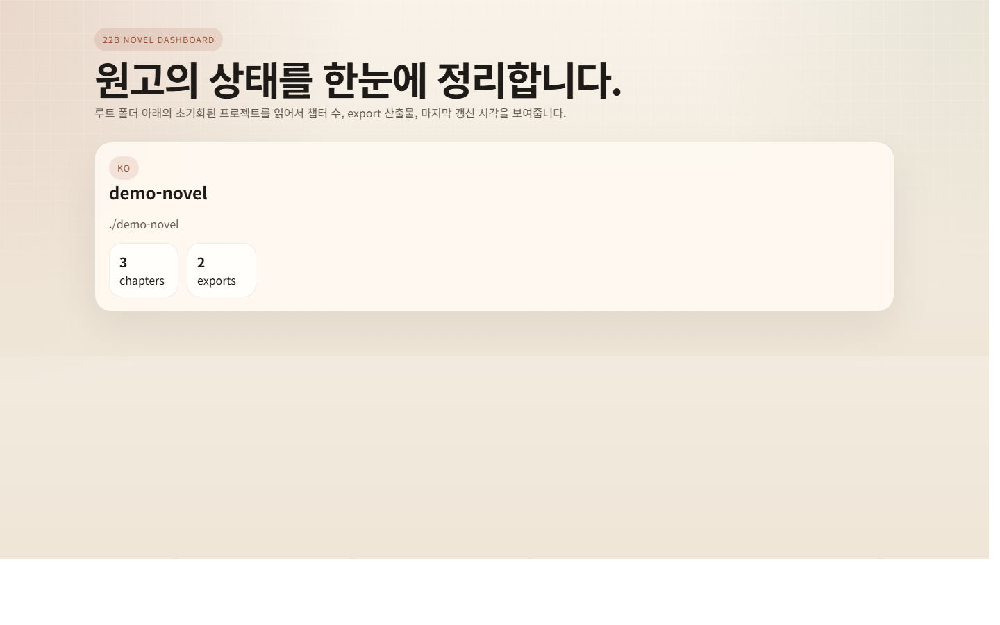
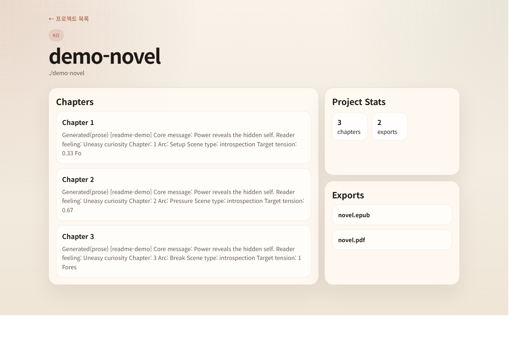

# 22B Novel

A TypeScript-based workspace for planning, generating, reviewing, exporting, and browsing long-form novels.

This is not just a "generate one chapter" script.  
It is structured as a full production workspace for long-form fiction: define Author DNA, generate chapters, store memory in SQLite, run quality review, and export the result as EPUB or PDF.

Related documents

- [Release Notes](./RELEASE_NOTES.en.md)
- [한국어 문서](./README.ko.md)

## 1. What This Project Does

### One-line summary

`Author DNA -> project init -> chapter generation -> memory and review -> EPUB/PDF export -> dashboard`

### Overall flow



### Preview

Dashboard home



Project detail



### Core features currently included

| Feature | Description |
| --- | --- |
| Author DNA validation | Validates philosophy, characters, style, world, and meta config with Zod |
| Plot Architect | Builds a deterministic arc and chapter structure from Author DNA |
| Chapter Generator | Assembles chapter context and beat prompts into prose generation |
| Memory DB | Stores chapter summaries, characters, and foreshadowing state in SQLite |
| Runtime Router | Supports `stub`, `OpenAI`, and `Anthropic` providers through env vars |
| Quality Reviewer | Checks chapter length, protagonist continuity, banned phrases, and unresolved foreshadowing |
| Export | Produces `markdown`, `txt`, `json`, `epub`, and `pdf` |
| Dashboard | Web UI for project list, chapter previews, and exported artifacts |
| MCP Tools | `novel.init`, `novel.plot`, `novel.generate`, `novel.memory`, `novel.review`, `novel.export`, `novel.cost`, `novel.status` |

## 2. Project Structure

```text
packages/
  engine/       core domain logic
  cli/          local batch CLI
  mcp-server/   MCP tool surface
  dashboard/    Next.js App Router dashboard

docs/
  README.ko.md
  README.en.md
```

### Package roles

| Package | Role |
| --- | --- |
| `@22b/engine` | Author DNA, plot, generation, review, export, memory DB |
| `@22b/cli` | Terminal entrypoint for init, generate, review, export |
| `@22b/mcp-server` | MCP tool definitions and server factory |
| `@22b/dashboard` | Web UI for reading generated project state |

## 3. Quick Start

### 3-1. Requirements

- Node.js 24 or newer recommended
- npm
- Optional: `OPENAI_API_KEY` or `ANTHROPIC_API_KEY`

### 3-2. Install

```bash
npm install
```

### 3-3. Verify the workspace

```bash
npm run test -- --run
npm run build
```

### 3-4. Fastest usage path

1. Prepare an Author DNA JSON file.
2. Initialize a project through the CLI.
3. Generate chapters.
4. Review and inspect memory.
5. Export to the format you need.

Example:

```bash
node packages/cli/dist/index.js init C:\\work novels my-author-dna.json
node packages/cli/dist/index.js generate C:\\work\\novels\\my-project 1 3
node packages/cli/dist/index.js review C:\\work\\novels\\my-project 1,2,3
node packages/cli/dist/index.js export C:\\work\\novels\\my-project 1 3 My Novel --format epub
```

## 4. Environment Variables

### Provider selection

The default provider is `stub`.  
That means you can test the full workflow even without API keys.

| Variable | Description |
| --- | --- |
| `NOVEL_PROVIDER` | Global default provider (`stub`, `openai`, `anthropic`) |
| `NOVEL_MODEL` | Global default model name |
| `NOVEL_PROVIDER_PLOT` | Plot provider override |
| `NOVEL_MODEL_PLOT` | Plot model override |
| `NOVEL_PROVIDER_PROSE` | Prose provider override |
| `NOVEL_MODEL_PROSE` | Prose model override |
| `NOVEL_PROVIDER_QA` | QA provider override |
| `NOVEL_MODEL_QA` | QA model override |
| `OPENAI_API_KEY` | Required for OpenAI |
| `ANTHROPIC_API_KEY` | Required for Anthropic |
| `OPENAI_BASE_URL` | Optional OpenAI-compatible gateway |
| `ANTHROPIC_BASE_URL` | Optional Anthropic-compatible gateway |
| `NOVEL_DASHBOARD_ROOT` | Root directory scanned by the dashboard |

Example:

```powershell
$env:NOVEL_PROVIDER = "anthropic"
$env:NOVEL_MODEL_PROSE = "claude-sonnet-4-6"
$env:ANTHROPIC_API_KEY = "your-key"
```

## 5. CLI and MCP Tools

### CLI commands

| Command | Description |
| --- | --- |
| `help` | Print available commands |
| `status` | Print engine status |
| `init <rootDir> <projectName> <authorDnaPath>` | Create a project |
| `generate <projectDirectory> <from> <to>` | Generate chapters |
| `memory <projectDirectory> <query>` | Query project memory |
| `review <projectDirectory> <chapterCsv>` | Review generated chapters |
| `export <projectDirectory> <from> <to> <title> [--format <format>]` | Create exports |
| `cost <chapters> [chapterWordCount]` | Estimate cost |

### MCP tools

| Tool | Description |
| --- | --- |
| `novel.init` | Create a local project |
| `novel.plot` | Build plot architecture |
| `novel.generate` | Generate a chapter batch |
| `novel.memory` | Query the memory DB |
| `novel.review` | Run rule-based quality review |
| `novel.export` | Export in multiple formats |
| `novel.cost` | Estimate token cost |
| `novel.status` | Show current status |

## 6. Web Dashboard

The dashboard is intended as a reading and monitoring surface.  
Think of it as a project console, not yet a full editor.

### Run it

Set the root directory, then start the dashboard workspace.

```powershell
$env:NOVEL_DASHBOARD_ROOT = "C:\\work\\novels"
npm run dashboard:dev
```

Default address:

```text
http://localhost:3000
```

### What you can see

- Project list
- Chapter counts per project
- Exported artifact filenames
- Chapter previews

## 7. What the Quality Reviewer Checks

The current reviewer intentionally focuses on concrete rules we can validate reliably with the data already present.

| Rule | Description |
| --- | --- |
| `length` | Warns when the chapter is too short relative to the configured target |
| `consistency` | Warns when the protagonist name does not appear in the chapter text |
| `voice` | Checks whether banned phrases from `neverDo` appear in the text |
| `foreshadow` | Warns about unresolved foreshadowing seeded in earlier chapters |
| `missing-file` | Critical issue when a requested chapter file is missing |

## 8. Export Formats

| Format | Output |
| --- | --- |
| `markdown` | Combined manuscript `.md` |
| `txt` | Plain text manuscript `.txt` |
| `json` | Structured JSON with chapters |
| `epub` | EPUB for e-readers |
| `pdf` | PDF for sharing and review |

Examples:

```bash
node packages/cli/dist/index.js export C:\\work\\novels\\my-project 1 10 My Novel --format pdf
node packages/cli/dist/index.js export C:\\work\\novels\\my-project 1 10 My Novel --format json
```

## 9. Who This Is For

- Solo writers who want to generate long-form web novel drafts quickly
- Small teams that want a consistent Author DNA workflow
- Developers who want to connect novel tooling to MCP-based agents
- Users who want generation, memory, review, and export in one pipeline

## 10. Current Status and Notes

### Working well right now

- Full test suite passes
- Full build passes
- Dist-based CLI smoke test passes
- OpenAI and Anthropic provider support is included
- EPUB and PDF generation are included
- Dashboard build passes

### Things to keep in mind

- `node:sqlite` may still print an ExperimentalWarning on Node 24.
- The current dashboard is focused on reading and inspection.
- The quality reviewer is a practical first-pass reviewer, not a literary critic.

## 11. Developer Commands

```bash
npm install
npm run test -- --run
npm run build
npm run dashboard:dev
```

## 12. Public Repository Safety

This repository is prepared for public sharing.  
Keep `.env`, API keys, personal data, caches, and generated junk out of commits, and preserve the current `.gitignore` rules.
