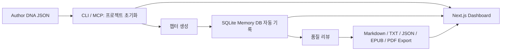

# 22B Novel

긴 장편 웹소설을 한 번에 설계하고, 생성하고, 점검하고, 내보내기까지 이어주는 TypeScript 기반 작업 도구입니다.

이 프로젝트는 "소설 초안 한 편을 뽑는 스크립트"가 아니라, 장편 제작 흐름 전체를 다루기 위한 작업 공간입니다.  
Author DNA로 작품 성격을 정의하고, 챕터를 생성하고, 메모리 DB에 누적하고, 품질 리뷰를 돌리고, 마지막에는 EPUB/PDF까지 뽑을 수 있게 구성했습니다.

## 1. 이 프로젝트가 하는 일

### 한 줄 요약

`작가 설정 → 프로젝트 초기화 → 챕터 생성 → 메모리/리뷰 확인 → EPUB/PDF export → 대시보드 확인`

### 전체 흐름



### 현재 들어있는 핵심 기능

| 기능 | 설명 |
| --- | --- |
| Author DNA 검증 | 작품 철학, 캐릭터, 스타일, 세계관, 메타 정보를 Zod로 검증 |
| Plot Architect | Author DNA를 바탕으로 장편용 기본 아크/챕터 구조 생성 |
| Chapter Generator | 챕터별 컨텍스트와 beat prompt를 조합해 본문 생성 |
| Memory DB | SQLite에 챕터 요약, 등장인물, 복선 상태를 누적 저장 |
| Runtime Router | `stub`, `OpenAI`, `Anthropic` provider를 환경변수로 선택 가능 |
| Quality Reviewer | 길이, 주인공 일관성, 금지 표현, 미회수 복선 경고 |
| Export | `markdown`, `txt`, `json`, `epub`, `pdf` 생성 |
| Dashboard | 프로젝트 목록, 챕터 프리뷰, export 결과를 웹에서 확인 |
| MCP Tools | `novel.init`, `novel.plot`, `novel.generate`, `novel.memory`, `novel.review`, `novel.export`, `novel.cost`, `novel.status` |

## 2. 폴더 구조

```text
packages/
  engine/       핵심 도메인 로직
  cli/          로컬 배치용 CLI
  mcp-server/   MCP 도구 표면
  dashboard/    Next.js App Router 대시보드

docs/
  README.ko.md
  README.en.md
```

### 패키지 역할

| 패키지 | 역할 |
| --- | --- |
| `@22b/engine` | Author DNA, plot, generation, review, export, memory DB |
| `@22b/cli` | 터미널에서 프로젝트를 생성/생성/리뷰/export |
| `@22b/mcp-server` | MCP 도구 정의와 서버 팩토리 |
| `@22b/dashboard` | 생성된 프로젝트를 읽는 웹 UI |

## 3. 빠른 시작

### 3-1. 준비물

- Node.js 24 이상 권장
- npm
- 선택 사항: `OPENAI_API_KEY` 또는 `ANTHROPIC_API_KEY`

### 3-2. 설치

```bash
npm install
```

### 3-3. 기본 검증

```bash
npm run test -- --run
npm run build
```

### 3-4. 가장 빠른 사용 순서

1. Author DNA JSON 파일을 준비합니다.
2. CLI로 프로젝트를 초기화합니다.
3. 챕터를 생성합니다.
4. 리뷰와 메모리를 확인합니다.
5. 원하는 포맷으로 export 합니다.

예시:

```bash
node packages/cli/dist/index.js init C:\\work novels my-author-dna.json
node packages/cli/dist/index.js generate C:\\work\\novels\\my-project 1 3
node packages/cli/dist/index.js review C:\\work\\novels\\my-project 1,2,3
node packages/cli/dist/index.js export C:\\work\\novels\\my-project 1 3 My Novel --format epub
```

## 4. 환경변수

### provider 선택

기본값은 `stub` 입니다.  
즉, API 키가 없어도 테스트용 생성 흐름은 돌릴 수 있습니다.

| 변수 | 설명 |
| --- | --- |
| `NOVEL_PROVIDER` | 전체 기본 provider (`stub`, `openai`, `anthropic`) |
| `NOVEL_MODEL` | 전체 기본 모델명 |
| `NOVEL_PROVIDER_PLOT` | plot 전용 provider override |
| `NOVEL_MODEL_PLOT` | plot 전용 모델 override |
| `NOVEL_PROVIDER_PROSE` | prose 전용 provider override |
| `NOVEL_MODEL_PROSE` | prose 전용 모델 override |
| `NOVEL_PROVIDER_QA` | QA 전용 provider override |
| `NOVEL_MODEL_QA` | QA 전용 모델 override |
| `OPENAI_API_KEY` | OpenAI 사용 시 필요 |
| `ANTHROPIC_API_KEY` | Anthropic 사용 시 필요 |
| `OPENAI_BASE_URL` | OpenAI 호환 게이트웨이 사용 시 선택 |
| `ANTHROPIC_BASE_URL` | Anthropic 호환 게이트웨이 사용 시 선택 |
| `NOVEL_DASHBOARD_ROOT` | 대시보드가 읽을 프로젝트 루트 경로 |

예시:

```powershell
$env:NOVEL_PROVIDER = "anthropic"
$env:NOVEL_MODEL_PROSE = "claude-sonnet-4-6"
$env:ANTHROPIC_API_KEY = "your-key"
```

## 5. CLI와 MCP 도구

### CLI 명령

| 명령 | 설명 |
| --- | --- |
| `help` | 사용 가능한 명령 출력 |
| `status` | 현재 엔진 상태 출력 |
| `init <rootDir> <projectName> <authorDnaPath>` | 프로젝트 생성 |
| `generate <projectDirectory> <from> <to>` | 챕터 생성 |
| `memory <projectDirectory> <query>` | 메모리 조회 |
| `review <projectDirectory> <chapterCsv>` | 챕터 리뷰 |
| `export <projectDirectory> <from> <to> <title> [--format <format>]` | export 생성 |
| `cost <chapters> [chapterWordCount]` | 예상 비용 계산 |

### MCP 도구

| 도구명 | 설명 |
| --- | --- |
| `novel.init` | 로컬 프로젝트 생성 |
| `novel.plot` | Plot architecture 생성 |
| `novel.generate` | 챕터 묶음 생성 |
| `novel.memory` | 메모리 DB 질의 |
| `novel.review` | 규칙 기반 품질 리뷰 |
| `novel.export` | 여러 포맷으로 export |
| `novel.cost` | 비용 추정 |
| `novel.status` | 현재 상태 요약 |

## 6. 웹 대시보드

대시보드는 생성된 프로젝트를 읽는 용도입니다.  
편집기라기보다 "프로젝트 상황판"에 가깝습니다.

### 실행

루트 경로를 지정한 뒤 dashboard 패키지를 실행합니다.

```powershell
$env:NOVEL_DASHBOARD_ROOT = "C:\\work\\novels"
npm run dashboard:dev
```

기본 주소:

```text
http://localhost:3000
```

### 볼 수 있는 것

- 프로젝트 목록
- 프로젝트별 챕터 개수
- export 결과 파일 목록
- 챕터 프리뷰

## 7. 품질 리뷰는 무엇을 검사하나

현재 리뷰어는 과장된 AI 평론을 하지 않고, 지금 데이터로 확실히 잡을 수 있는 규칙 위주로 동작합니다.

| 규칙 | 설명 |
| --- | --- |
| `length` | 챕터 분량이 목표치 대비 너무 짧은지 검사 |
| `consistency` | 주인공 이름이 챕터 본문에 아예 없으면 경고 |
| `voice` | Author DNA의 `neverDo` 문구가 본문에 들어갔는지 검사 |
| `foreshadow` | 이전 챕터에서 심은 복선이 아직 미회수 상태인지 경고 |
| `missing-file` | 지정한 챕터 파일이 아예 없을 때 치명 오류 |

## 8. export 포맷

| 포맷 | 결과 |
| --- | --- |
| `markdown` | 합본 원고 `.md` |
| `txt` | 텍스트 원고 `.txt` |
| `json` | 챕터 구조 포함 JSON |
| `epub` | 전자책 리더용 EPUB |
| `pdf` | 공유/검토용 PDF |

예시:

```bash
node packages/cli/dist/index.js export C:\\work\\novels\\my-project 1 10 My Novel --format pdf
node packages/cli/dist/index.js export C:\\work\\novels\\my-project 1 10 My Novel --format json
```

## 9. 누구에게 맞는가

- 장편 웹소설 초안을 빠르게 돌리고 싶은 개인 작가
- Author DNA 기반으로 톤 일관성을 관리하고 싶은 팀
- MCP로 외부 에이전트와 붙여서 작업하고 싶은 개발자
- 장편 생성 과정에서 복선, 리뷰, export를 한 흐름으로 다루고 싶은 사용자

## 10. 현재 상태와 주의점

### 지금 잘 되는 것

- 전체 테스트 통과
- 전체 빌드 통과
- dist 기준 CLI 스모크 통과
- OpenAI / Anthropic provider 연결
- EPUB / PDF 생성
- Dashboard build 통과

### 알고 있어야 할 점

- `node:sqlite`는 Node 24에서 ExperimentalWarning이 보일 수 있습니다.
- 현재 dashboard는 "읽기용" 중심입니다.
- 품질 리뷰는 규칙 기반 1차 검수에 가깝고, 문학적 평가기까지는 아닙니다.

## 11. 개발자용 명령

```bash
npm install
npm run test -- --run
npm run build
npm run dashboard:dev
```

## 12. 라이선스와 공개 주의

이 저장소는 공개 공유를 전제로 정리되어 있습니다.  
`.env`, API 키, 개인 데이터, 생성 캐시를 커밋하지 않도록 `.gitignore`를 유지하세요.
